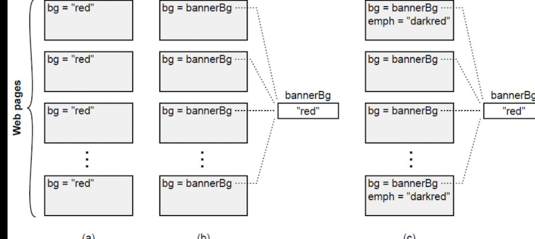

## Chapter 2: The Nature of Complexity

### 2.1 Complexity defined

> Complexity is anything related to the structure of a software system that makes it hard to understand and modify the system.

> If a software system is hard to understand and modify, then it is complicated; if it is easy to understand and modify, then it is simple

This tells me that as a developer, I can trust myself, the system has complexity if I feel it is hard to understand and modify it.
Knowing it is a good mindset, since as far as I suppress the sense, I can't identify the complexity. That means I might be going to miss the opportunities to improve the system.

☝️ It is important to follow my intuition to judge whether or not the system has complexity.

> Complexity is more apparent to readers than writers. If you write a piece of code and it seems simple to you, but other people think it is complex, then it is complex.

> Your job as a developer is not just to create code that you can work with easily, but to create code that others can also work with easily.

☝️ Code reviews are important to reduce the complexity.

### 2.2  Symptoms of complexity



-   Change amplification (a)
-   Cognitive load (b)
-   Unknown unknowns (c)
    -   The author says this is the worst symptom, because that measn there is something I need to know but no ways to find out what it is.

#### Symptoms 1: Change amplification

> a seemingly simple change requires code modifications in many different places.

-   We can use constants, for example, to reduce the change amplification.

```ts
const errorMessages = {
	invalid: "Invalid input", // Can be modifiled at once in all places to be used
	missing: "Missing input",
	tooLong: "Input too long",
	tooShort: "Input too short",
	notFound: "Input not found",
	duplicate: "Duplicate input",
	internalError: "Internal error",
	unknown: "Unknown error",
};
```

I think this first manifest is related to "encapsulate" approach, which is described as one of thew how to fight the complexity.

#### Symptoms 2: Cognitive load

> cognitive load, which refers to how much a developer needs to know in order to complete a task.

This will be more confidently addressed if I follow the definition of complexity and my intuition.

> Sometimes an approach that requires more lines of code is actually simpler, because it reduces cognitive load.

This second manifest feels like a good mindeset for code reviews. If I cannot undersand the code, that means there is a complexity for a reader, at least.

#### Symptoms 3: Unknown unknowns

> it is not obvious which pieces of code must be modified to complete a task, or what information a developer must have to carry out the task successfully.

> You won’t find out about it until bugs appear after you make a change.

Then how can we avoid this situation?
When the system is complicated, it would seemingly be easier to make this situation, because it was hard to find the consistency of the system, for example. The books says Chapter18 will cover the techniques to avoid this situation.

> One of the most important goals of good design is for a system to be obvious. This is the opposite of high cognitive load and unknown unknowns.

> An obvious system is one where a developer can make a quick guess about what to do, without thinking very hard, and yet be confident that the guess is correct.


```md
Dependencies lead to change amplification and a high cognitive load. Obscurity creates unknown unknowns, and also contributes to cognitive load.
```


## 2.3  Causes of complexity

> Complexity is caused by two things: dependencies and obscurity.

### Dependencies

-  Dependencies are happened when a given piece of code cannot be understood or modified in isolation.
   - Using hard-coded background color, and need to use the same color in many places, there is a dependency. All pages are dependent each other on the background color.
   - Creating a centralized variable for the background color, it creates a new dependency, but it is obvious.
- It is a fundamental part of the software design. And cannot be eliminated entirely. But it should be _simple and obvious_.


### Obscurity

> Obscurity occurs when important information is not obvious.

> obscurity comes about because of inadequate documentation;

> If a system has a clean and obvious design, then it will need less documentation.

- Need for documentation is a red flag that the design is not quite right.


### 2.4  Complexity is incremental

> Complexity isn’t caused by a single catastrophic error; it accumulates in lots of small chunks.

> A single dependency or obscurity, by itself, is unlikely to affect significantly the maintainability of a software system.

Eventually, the complexity will be accumulated and get hard to control.
Maintaining the system repeatedly is important to keep the system simple.


## 2.5  Conclusion

> Complexity comes from an accumulation of dependencies and obscurities.

> developers spend more time acquiring enough information to make the change safely and, in the worst case, they can’t even find all the information they need.

I feel this quite often. I need to spend time to understand the system before I start to modify it. 


<sub>\*All Imaeges and Refereces are from:
Ousterhout, John K. . A Philosophy of Software Design, 2nd Edition. Yaknyam Press. Kindle Edition. </sub>
